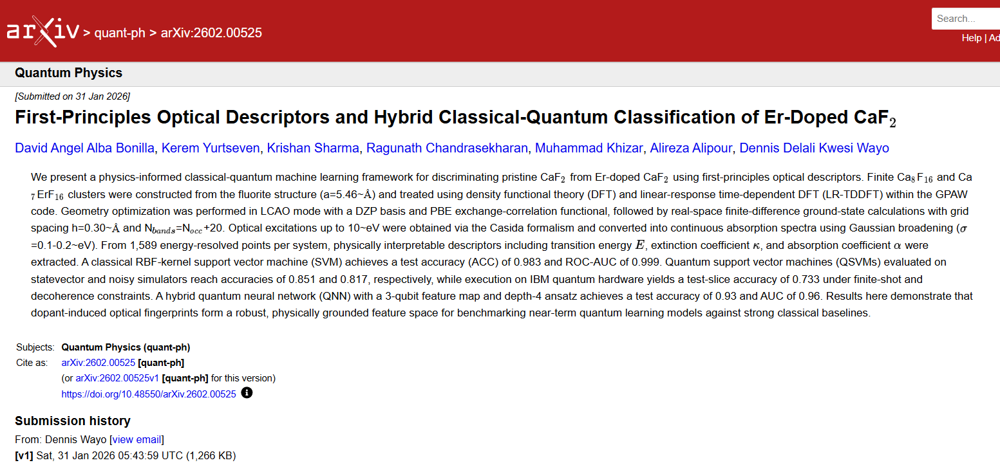

[](https://qiskit.org/advocates)  [](LICENSE)  [](https://www.python.org/)  [](https://wiki.fysik.dtu.dk/gpaw/)  [](https://qiskit.org/)

## Q-UCSpec: Integrating TDDFT Spectroscopy and Quantum Machine Learning for Photonic Upconversion Materials 



**arXiv preprint: [View on arXiv](https://arxiv.org/abs/2602.00525)** 

---

**Q-UCSpec** is an IBM QAMP 2025 project that integrates first-principles Linear Response (Lr) Time-Dependent Density Functional Theory (TDDFT) simulations with Quantum Machine Learning (QML) to explore the optical spectra of photonic upconversion materials.  

The project focuses on:
- Generating TDDFT absorption spectra for host and doped systems (CaF₂ + Ca₂F:Er clusters).  
- Extracting spectral descriptors (first moment, variance, peak energy, spectral area).  
- Encoding these features into quantum feature maps with Qiskit.  
- Benchmarking QSVM / QNN against classical ML models.

This project is part of the **Qiskit Advocate Mentorship Program (QAMP) 2025**.  

---

### Repository Structure

```bash
Q-UCSpec/
├── simulations_gpaw/   # ASE + GPAW scripts for CaF2, Ca3F:Er clusters
├── spectra-results/    # TDDFT stick and broadened spectra-results (CSV)
├── data/               # Extracted spectral descriptors for ML/QML
├── qiskit_qml/         # Quantum ML notebooks (QSVM, EstimatorQNN)
├── docs/               # Documentation and project notes
└── README.md
```

---
### ⚙️ Installation & Setup

#### Clone the repository
```python
git clone https://github.com/DennisWayo/Q-UCSpec.git
cd Q-UCSpec
```

#### (A) macOS users
```python
conda env create -f env-gpaw-mac.yml
conda activate gpaw-tddft-legacy
```

#### (B) Windows users
gpaw does not have a valid 25.1.0 release for Windows. One simple and efficient way is to use WSL and Ubuntu.
For detailed installation instructions, please refer to [Installation & Setup for Windows Users](WSL_setup.md).

#### (C) Linux users
```python
conda env create -f env-gpaw-linux.yml
conda activate gpaw-tddft-legacy
```

#### Verify installation
```python
python -c "import gpaw, ase, qiskit; print('YES, Environment ready!')"
```

#### Test installation
```python
python -c "import gpaw; import ase; import qiskit; print('YES! Environment ready')"
```

- For gpaw dzp-PAW/basis files: (applicable to all OS)
```bash
import os
default_path = os.path.expanduser("~/gpaw-setups-24.11.0")
if not os.path.exists(default_path):
    os.system("wget https://wiki.fysik.dtu.dk/gpaw-files/gpaw-setups-24.11.0.tar.gz && tar -xvzf gpaw-setups-24.11.0.tar.gz")
os.environ["GPAW_SETUP_PATH"] = default_path
print(f"Using GPAW setup path: {os.environ['GPAW_SETUP_PATH']}")
```
---


### Mentorship
Mentor: 
- [Dennis Wayo](https://github.com/DennisWayo)

QAMP 2025/2026 Project Mentees: Q-UCSpec

- [DavidAlba2627](https://github.com/DavidAlba2627),
- [keremyurtseven](https://github.com/keremyurtseven),
- [Alireza Alipour](https://github.com/AlirezaAlipour-ghb),
- [GHOST-Q1](https://github.com/GHOST-Q1),
- [DreamzUpAbove](https://github.com/DreamzUpAbove),
- [Krishan Sharma](https://github.com/Krishan019).

```bash
Mentees will:
- Learn lr-TDDFT workflow with GPAW + ASE.
- Run simulations of photonic upconversion clusters.
- Apply QML with Qiskit to spectral datasets.
- Contribute code, documentation, and benchmarking analysis.
```

### Acknowledgements
- Qiskit Advocate Mentorship Program (QAMP) @qiskit-advocate @IBM
- ASE + GPAW developers @gpaw @ase
- Qiskit Machine Learning team
- Research inspiration: Photonic upconversion in CaF₂:Er system

### Reports - Month 1:

- Successfully installed GPAW and all dependencies across macOS (Intel), Linux, and Windows (WSL+Ubuntu) environments.
- Successfully excecuted the sim_master.ipynb file for Lr-TDDFT calculations.

### Reports - Month 2:

- Feature engineering, including feature selection and transformation.
- Successfully implemented SVM, QSVM, QNN, and VQC models to distinguish CaF₂ and Ca₂F:Er systems.

### Reports - Month 3:

- Successfully implemented a hybrid QNN architecture.
- Successfully implemented QSVM on a noisy simulator.
- Executed QSVM on IBM quantum hardware (`ibm_fez` quantum processor).
- Successfully completed the manuscript and uploaded the project preprint to [arXiv](https://arxiv.org/abs/2602.00525).

**Cite this work**
```bash
@misc{bonilla2026firstprinciplesopticaldescriptorshybrid,
      title={First-Principles Optical Descriptors and Hybrid Classical-Quantum Classification of Er-Doped CaF$_2$}, 
      author={David Angel Alba Bonilla and Kerem Yurtseven and Krishan Sharma and Ragunath Chandrasekharan and Muhammad Khizar and Alireza Alipour and Dennis Delali Kwesi Wayo},
      year={2026},
      eprint={2602.00525},
      archivePrefix={arXiv},
      primaryClass={quant-ph},
      url={https://arxiv.org/abs/2602.00525}, 
}
```


